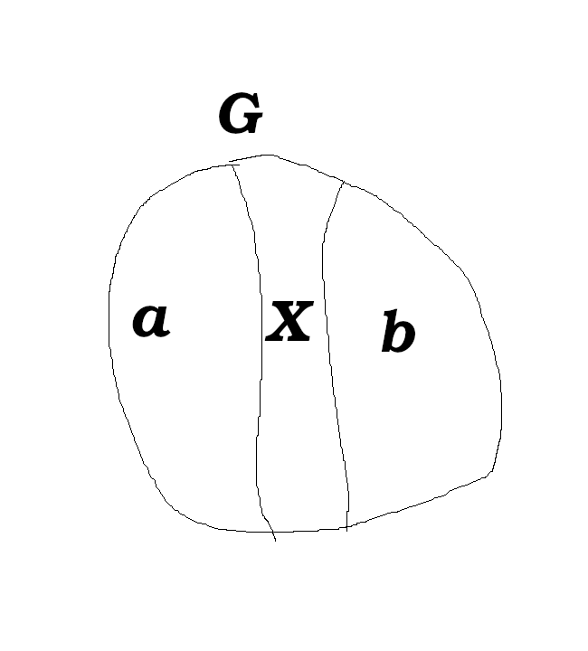
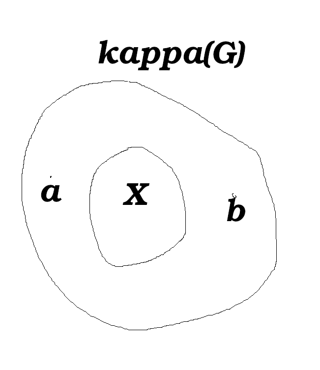
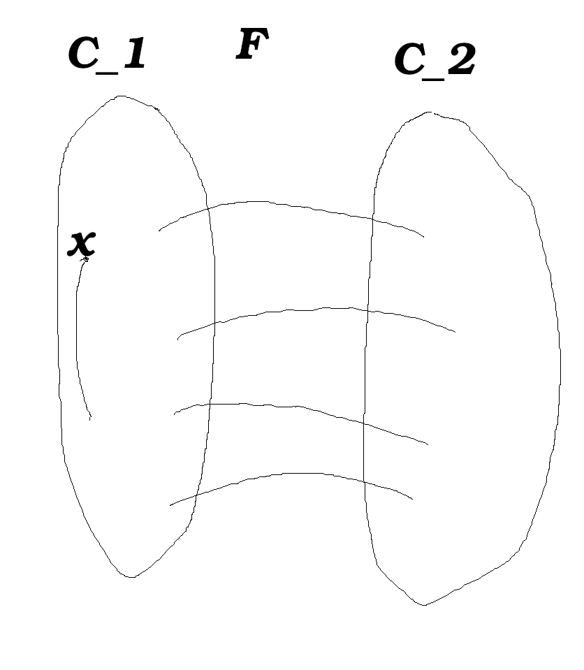
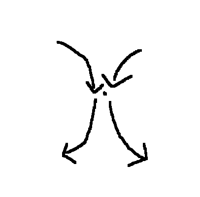

# Lecture 2

degree: number of verticies connected to a vertex?

## Table of Contents

Graph theory: Per Alexandersson

* Terminology
* Spanning trees
* Connections
* Euler tours
* Hamiltonian cycles

## Terminology

Walk - visit same vertex and edges multiple times

Trail - walk with no repeated edges

Path - walk with no repeated verticies (and thus no repeated edges)

Cycle - Path visiting at least 3 verticies and the edge (x_0, x_n)
   - (no repeated verticies)

Circuit - closed trail (may have repeated verticies)

Tour - Circuit.

## Spanning tree

A tree that contains every vertex of the graph.

* Prim's algorithm for finding minimal spanning trees.
   - greedy algorithm
   - start with any smallest edge.
   - extend with the cheapest edge, over and over.
* Kruskal's algorithm for finding minimal spanning trees.
   - pick the cheapest edge globally, as long as we don't construct a cycle.
   - take the logarithm of weights: `w' = -ln(w)`

### Prim's algorithm

T* output of prim's algorithm
T': true MST is unique.

We want to prove that T* = T'.

Assume that they are not the same. `T* != T'`. Then there is some (the first edge added by Prim's algorithm that differs) edge $e_k = (a, b)$ in T* but not in T'.

T_{k-1} agrees with T', i.e. the first k-1 edges we added are the same as in T'.

If the extra edge also existed in T* then there would be a cycle. There is at least one missing edge.

e_k must be smaller than e' because that how we run Prim's algorithm. However, e' must be smaller than e_k because T' is the true minimal spanning tree. Thus, we have a contradiction.

## Connectivity

A-B path

### Separation

X \subseteq V \union E,

X *separates* A and B if every A-B path contains some element in X.

X separates G if there is some {a} = A, {b} = B, such that, X separates A and B.

G is k-Connected if for every X \subseteq V, |x| < k, G-X is connected.

\kappa(G) largest such K.

\lambda(G) same thing but X \subseteq E.

Recall: \delta(G) = minimal degree in G.

Prop: 1.42. If G is non-empty,

   \kappa(G) <= \lambda(G) <= \delta(G)

If you disconnect every edge from the minimum degree of G, that disconnects the graph.

Proof:

Suppose F \subseteq E(G) separates G, |F| = \lamda(G).

If one of the separating edges was part of one of the components C_1 or C_2, then the separating set would not have been minimal, as that edge was not needed to separate C_1 from C_2.

Case 1: x isn't an end-point of an edge in F.

(v, w) \notin F.

v has at most |F| neighbours that connect to F.

Case 2: C only consists of end-points of F.

deg(v) <= |F|

It may be the case that when we remove all the neighbours of F, then there is a special case where the entire C_1 (or C_2) component is removed, in which case the graph is not separated. As such, we remove the other component completely. If this happens, try a different components, and if it happens again, then try different components. If this happens for all components, then this must be a complete graph.

## Eulerian tour

Theorem 1.8.1: Every *connected* graph with *all degrees even* is **Eulerian**.

Eulerian tour: Visits all the edges exactly once.

If there is an Eulerian tour, then the graph has to be connected, and every vertex has to have an even degree. Since we need one degree to enter a vertex, and one degree to leave.

We take a cycle, and extend C, where in one vertex where it is connected to another Eulerian cycle, we take another edge instead of going back, and in this way we can take all the cycles and eventually end up in a big Eulerian tour.
