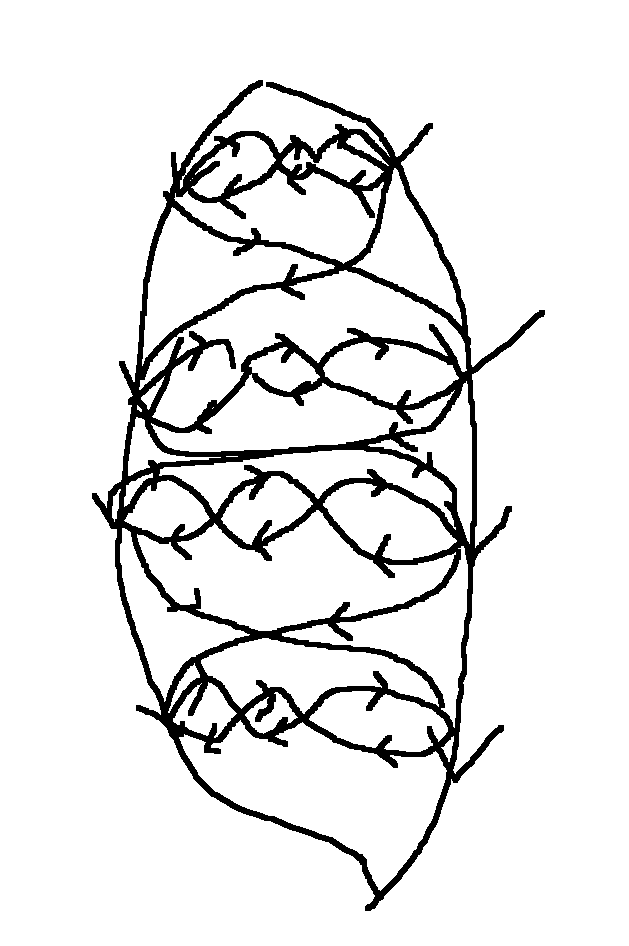

# Lecture 3

## P vs NP

P poly time (decision problems)
NP non-deterministic poly time

Yes-answers have a certificate that can be checked in poly time.

Examples:

Hamiltonian path: certificate is the hamiltonian path.
not k-connected: certificate is k-1 verticies that is disconnected.

## K-connectivity

For any (v, w) give k disjoint paths that connect v and w.

If we have three disjoint paths, then removing two verticies would not be enough to make the graph disconnected.

## P = NP?

P <= NP

P = NP?

Everybody P != NP.

## NP-complete problems

NP-complete problems are problems in NP such that if they are in P then P=NP.

An NP-complete problem can be used to translate *any* NP problem into a P problem in poly time?

Favourite problem:

Satisfiability of 3 CNF (conjunctive normal form) formulas - the 3 refers to clauses of 3:

(x_1 OR x_2 OR x_3) AND (NOT x_1 OR NOT X_2 OR NOT x_4) AND (x_1 OR x_2 OR x_4)

Cook-Levin theorem (1971 and 1973): 3-SAT is NP-complete.

## Theorem: Directed Hamiltonian path is NP-complete.

Proof: Take a formula on 3-CNF, compute graph G

Given a formula with n boolean variables m clauses of size 3.

Going left to right on level i "<=>" X_i = true

Add nodes corresponding to clauses that can be visited if that clause is true.

Hamiltonian path of basic graph

x_i false --->--- on i'th level

x_i false ---<---

Visit each clause vertex where you pass variable that satisfies the clause.

If you can solve Hamiltonan path, then you can solve 3-SAT.

The other way around also holds, by Cook-Levin.

Conclusion: We will not have necessary & sufficient conditions for Hamiltonicity.

(unless P=NP)

## co-NP

co-NP complement of NP.

Non-hamiltonian graphs \in co-NP.

Wide-held belief: co-NP != NP.

If co-NP != P then there are no easy ways to verify any general cetificates for non-Hamiltonicity.

## Favourite NP-complete problems

1970is.

Independent set: Given G are there k verticies no two verticies are  connected. ..?

3-colouring: Colour V with 3 colours such that no edge has endpoints of some colour.

(2-colour is easy to check)
2-colour <=> bipartite.

Approximability:

We cannot find largest independent set (IS). Maybe we can find a big one.

True answer k: Can efficiently find k.

NP-hard to distinguish. max IS = n^{i-\sigma}
                        max IS = n^{\sigma}      \forall \sigma > 0, n = |V|

Another approximate problem. Given a 3-colourable graph, how many colours do you need?

You most likely can't colour it with 3 colours in the general case - You need at least 4, since 3-colourability is NP-complete.

Theorem: It is possible to colour a 3-colourable graph with 2*\sqrt(n) colours in poly time.

Colour verticies greedily, each time you get to a vertex, look at it's neighbours and choose a colour not already chosen.

\sqrt(n) + 1 colours.

Neighbourhood is two-colourable, since the vertex we are at is given a colour. E.g. If our vertex is red, then it's neightbours are either blue or green.

Once we have coloured these, we remove these two colours (blue and green) and remove all those verticies from the graph, then continue.
