# Lecture 4 - flows

when are the homework problems given, and when are they due?
when is the paper review given, and when is it due?

Per Alexandersson

It is easier to prove things about matches if we have information about flow!

A flow is an assignment, a function on directed edges f(x, y) = -f(y, x) \in Z (integers). (x, y) \in V^2.

A pair of verticies (x, y) has a direction, an edge does not (according to the book).

If f(x, y) > 0 this is the amount of flow (e.g. water) leaving x going to y.

The total of incoming water should be the same as the total of outgoing.

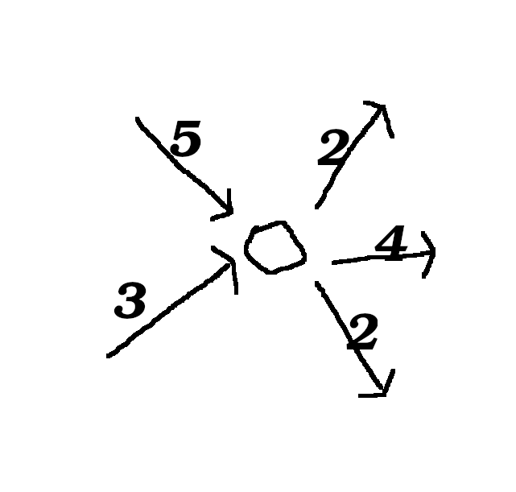

Kirchhoff's law (same amount of incoming as outgoing).

## Circulation

We have a flow f.

f(x, y) = -f(y, x) for all (x, y) \in V^2

Kirchhoff's law holds for every vertex in circulation?

\sum_{(v, x) \in V^2}(f(v, x)) = \sum_{(y,v) \in V^2}(f(y, v))     for all v \in V

<=>

\sum_{e \in E, v,(v,x) \in e \forall x}(f(e)) = 0

x, y \subseteq V

->
F(X, Y) = {set edegs starting in X, ending in Y}

Measures how much water is flowing from X to Y:

   Define f(x, y) := \sum_{(x,y) \in F(X, Y)}(f(x, y))

Amount of water flowing from X to X.

   f(x, x) = 0

Every edge is counted twice, once in each direction with opposite signs, so the total has to be zero.

_
x
\bar{x} = complement of x.

f(x, \bar{x}) = 0

Compute the flow out for every vertex. All the internal edges are going to cancel.

f(x, V) = 0    (x to everything by Kirchhoff's law is 0)

f(x, x \union \bar{x}) = f(x, x) + f(x, \bar{x})
f(x, V) = 0 + f(x, \bar{x})
0 = f(x, \bar{x})

## Networks

N(G, S, t, c)   c = capacuty, c(x, y) >= 0 for all (x, y) \in V^2

c(x, y) : V^2 -> N_0

How much flow we allow on each edge.

A flow on N is a function f such that

* f(x, y) = -f(y, x)
* f(v, V) = 0  for all v \ in V \{s, t}
* f(x, y) <= c(x, y)

f(s, v) >= 0
f(v, t) >= 0

## Cut

A *cut* is a set S \subseteq V, s \in S, t \in \bar{S}

Capacity of a cut:

Define c(S, \bar{S}) as before.

Flow across the cut is the same as the flow out of the source.
f(s, \bar{s}) = f({s}, V) = |f|

Value of f.

The total amount of water flowing from left to right over the cut is the same as the outgoing amount from the source s.

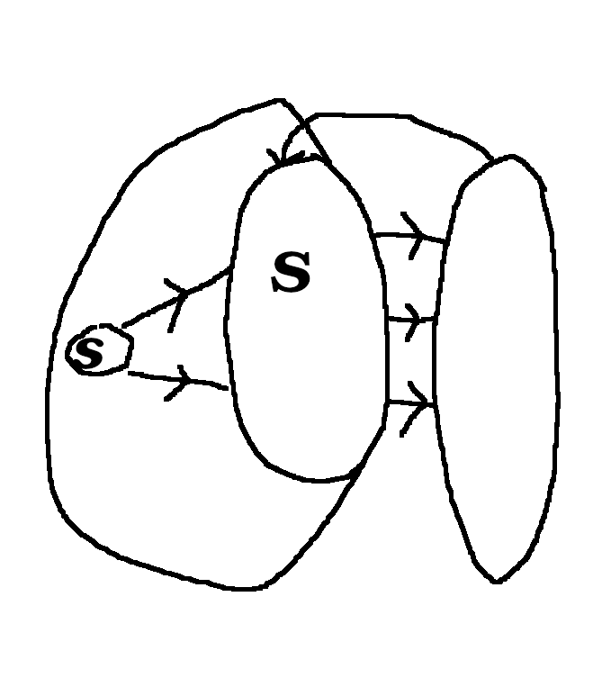

Want to find f that maximizes |f|

Max flowing cut theorem.

   f(S, \bar{s}) <= c(S, \bar{S})    for all cuts S.

The flow that maximizes this happens exactly when we can find equality.

Max-flow = min-cut

## Ford-Foulkerson alg.

Step 1:

Edge is saturated, cannot push more from s to b

The direction of a flow could flip with this algorithm.

Step 2:
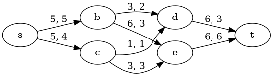

We do not follow paths that are already saturated. We follow paths where we can increase the flow.

## Matchings in bipartite graphs

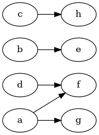

Matching as flow.

Connect a source to the nodes of the left side of the bipartite graph and the nodes of the right side of the bipartite graph to a sink.

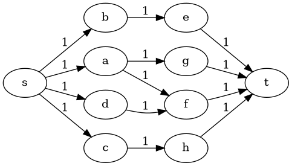

## Menger's theorem (edge)

(edge, 3.3.31)

G = (V, E) graph, A, C \subseteq V

Then minimal # of *edges* separating A and B = maximal # of *edge*-disjoint A-B-paths.

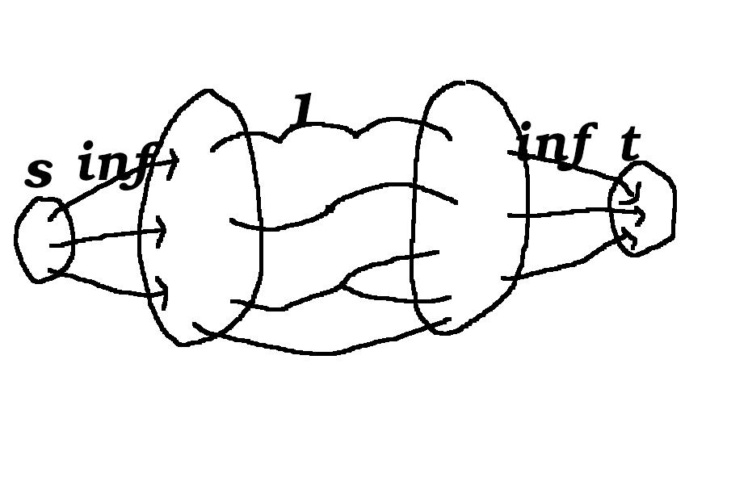

Let t be a maximal flow.

|f| = # edge-disjoint paths.

## Menger's theorem (vertex)

G = (V, E) graph, A, C \subseteq V

Then minimal # of *verticies* separating A and B = maximal # of *vertex*-disjoint A-B-paths.

Since the edge has capacity one, you can only have incoming flow from one predecessor node.

Key idea: Removal of edges in the old graph correspond to removal of verticies in the new graph.

## Hall's Marriage theorem

Bipartite graph and for every A \subseteq X

R(A) >= |A|

R(A) are the neighbours of A. (you don't count edges twice, so it's not the sum of the degrees of neighbours of A_i through A_n)

Then G has an X-matching.

Every person in X is going to match with one person in Y, but there might be people in Y with no matching.

Then G has an X-matching.

Maximal flow |f| is at most |X|.

Max-flow min-cut.

S = X' \union Y'

|X| >= |X'| + |Y'|

Maximum flow goes from S to \bar{S}.

X' matched with Y''
X'' matched with Y'

|X''| <= |X'|

# Lecture 4 - Gabriel's notes
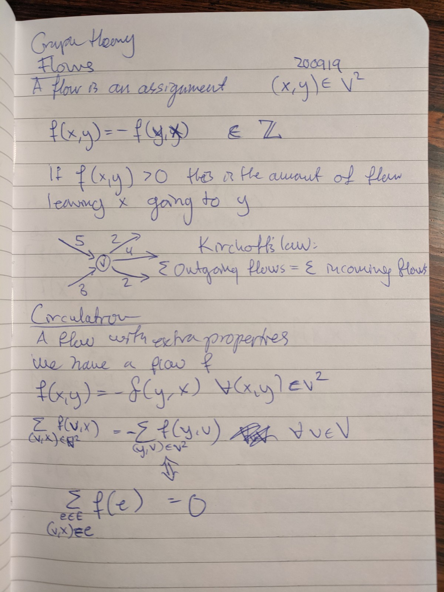
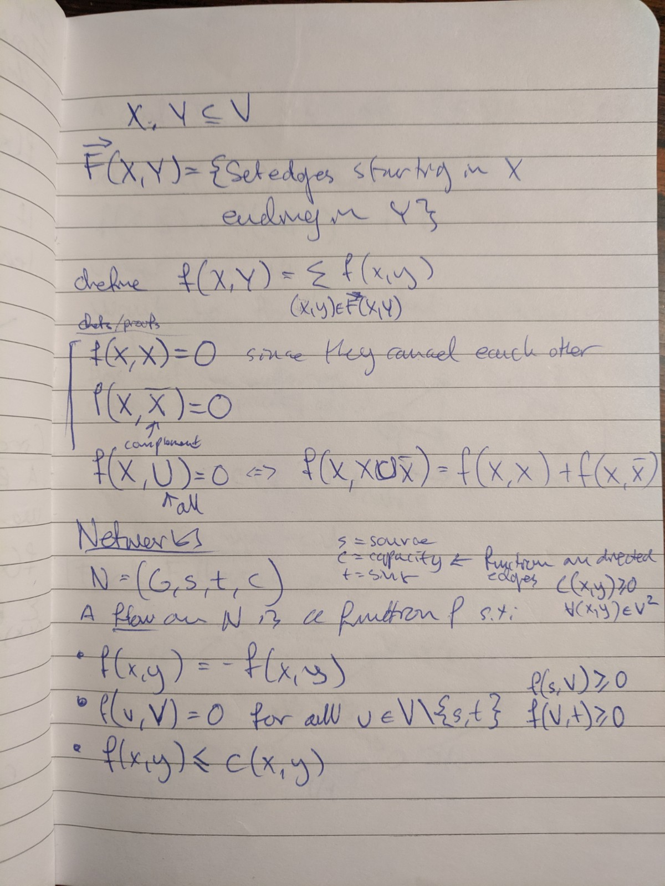
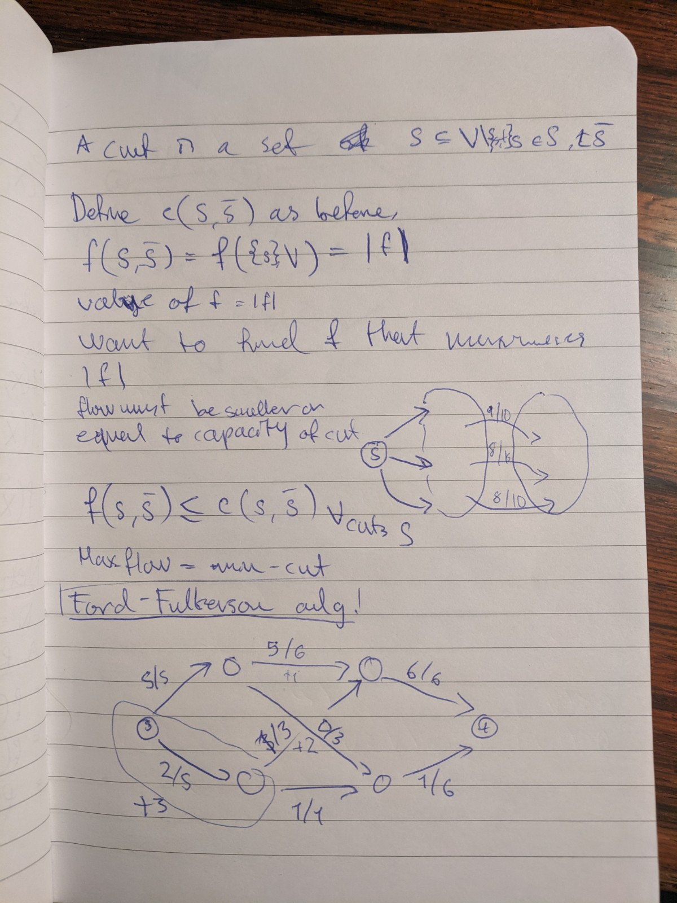
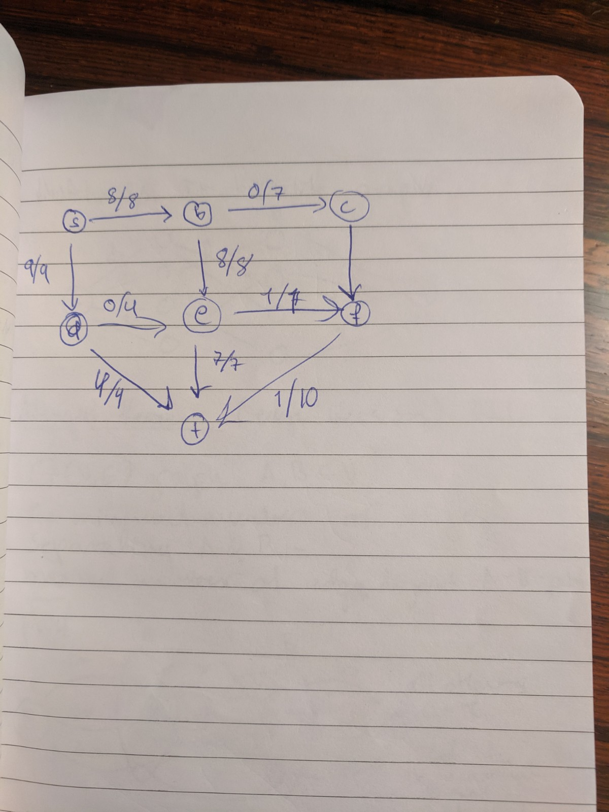
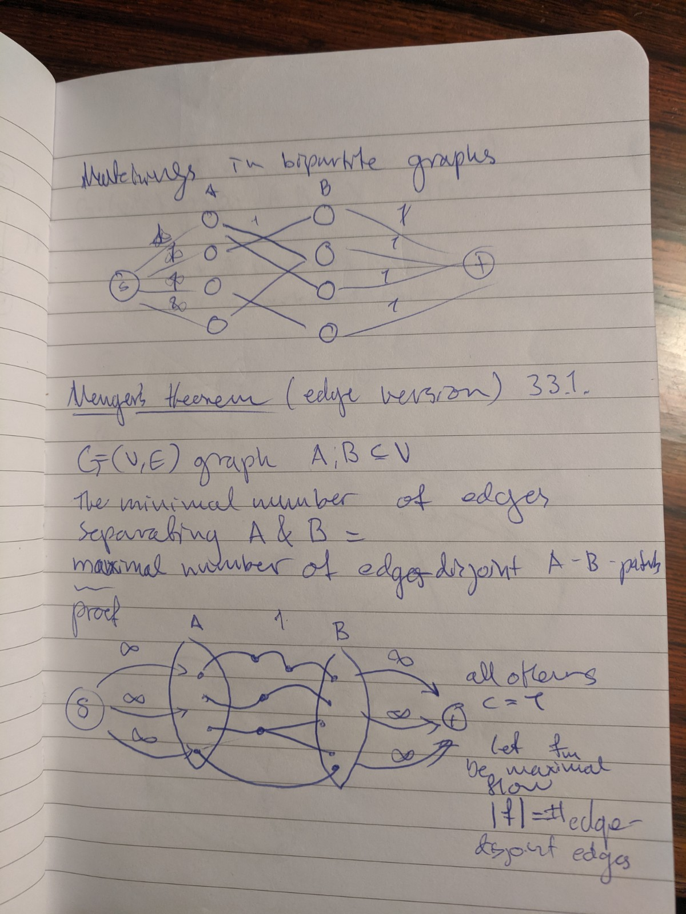
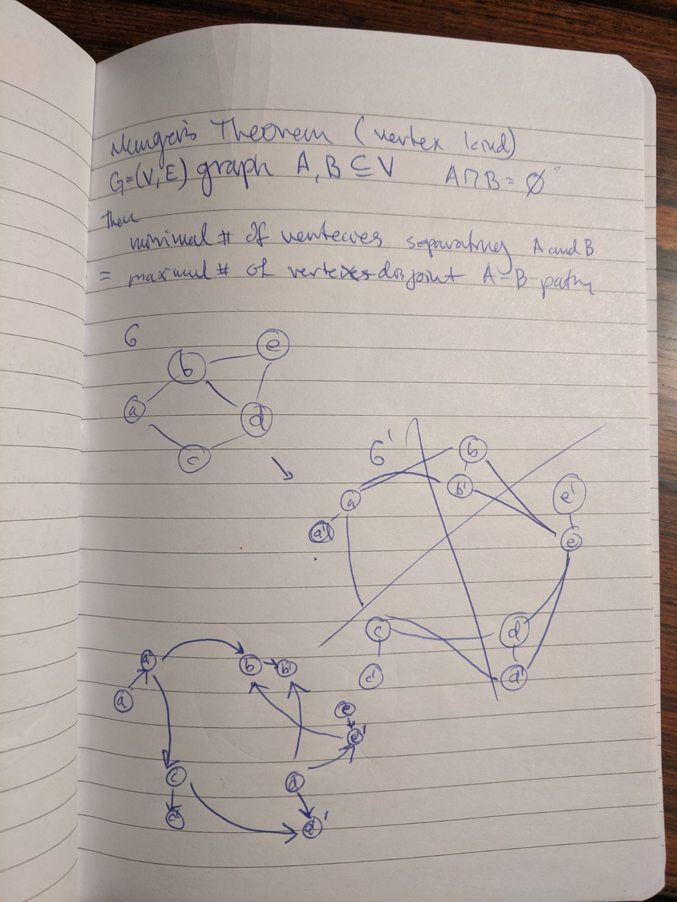
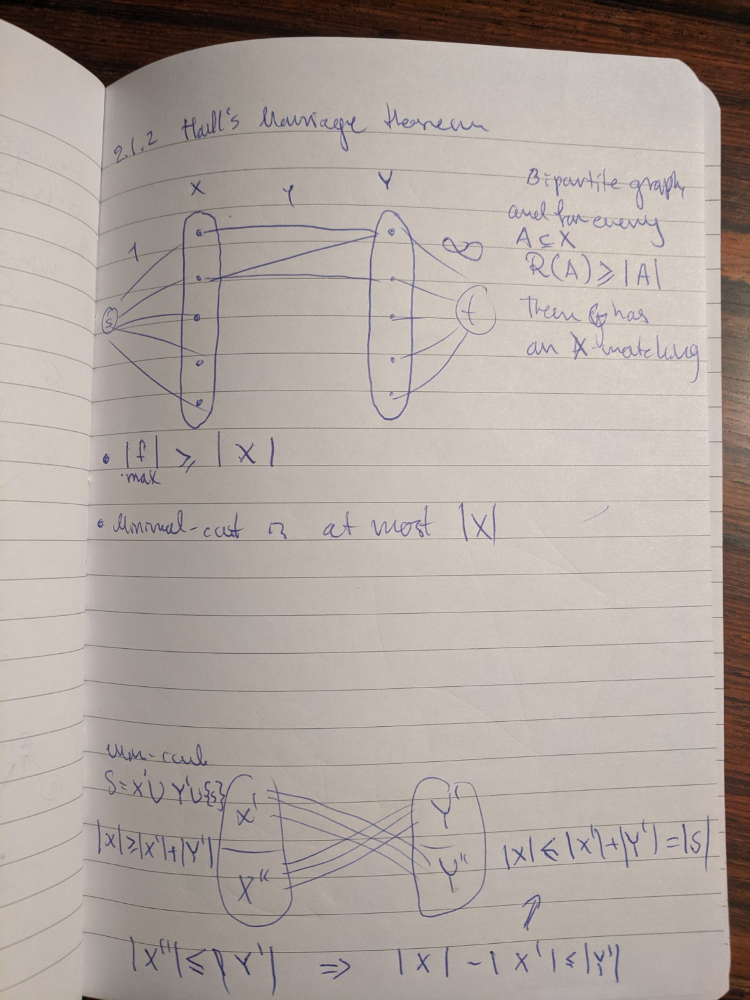
