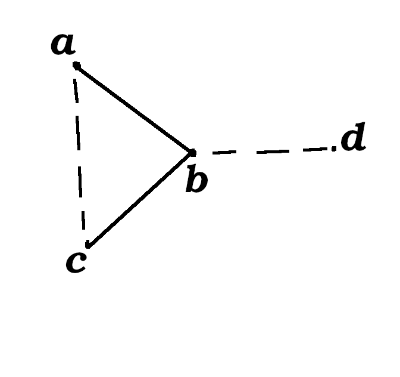
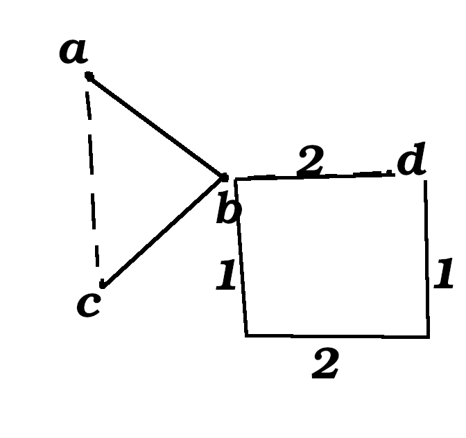

# Lecture 5

## Menger

Menger's theorem

k-edge connected <=> k edge disjoint paths \forall u,v

k-vertex connected <=> k vertex disjoint paths \forall A,B (end points)

Min-cut = max-flow

## Hall - Perfect matching

Theorem. Hall (most used theorem in Graph Theory)

\forall A |N(A)| >= |A|

<=> Perfect matching

Neighbours of A: N(A)

### Proof

Add a source and a sink, directed graph from source to sink from the A to the B side of a bipartite graph.

Maximum matching is the maximum flow.

n = number of verticies on the left side

Cut cost:

min_{over all A}    n - |A| + N(A) = max flow over all A
                                   = max matching

## König Theorem.

Vertex cover (VC):    set of verticies that touch all edges
Maximal matching:     disjoint edges

Size of vertex cover >= size of maximal matching

Königs theorem: min VC = max-matching in bipartite graph


\bar{A}   complement of A

\bar{A} and N(A) is a VC for any A.

Take the best A that makes this as small as possible, i.e. the minimum-cut.

min_{for all A}   n - |A| + |N(A)| = maximum matching


## Theorem for perfect matching on regular bipartite graphs

Theorem.

(# neighbours = r) regular if same $r$ on all verticies.

A regular bipartite graph with with n verticies on each side has a perfect matching.


Proof. Need to prove |N(A)| >= |A|

for any A:


```
.       .
.       .
A      N(A)
.       .
.       .
.       .
```

Count all edges starting in A.

r|A|

How many enter into N(A) <= r|N(A)|

Thus:
|N(A)| >= |A|

Proof done.

In fact it is the union of r perfect matchings, Induction over r.

## Augmenting paths

Augmentings paths for matching M.

M is a matching (a set of edges)

Paths that starts and ends at an unmatched vertex and every edge belongs to M (switching increases M).

Now in general graphs

M has an augmenting path => M is of maximum size.


M one matching

M' a bigger matching

Look at graph with only edges from M & M'

Verticies have degrees 0,1,2

degree 0: isolated vertices
degree 1: paths
degree 2: cycles

Cycles of even length.     Since it is a matching, it has to be every other from M and not M, so if it ends up as a cycle, the cycle is of even length.

Every other edge from M and M' so they have to be of even length.

Paths
   even length    same number of verticies from M and M'
   odd length     at least one with one more edge from M'

## Matching in general

Graphs obstruction

s = set of verticies
G\S has t connected components of which r are at odd size


If there is an obstruction, S, such as this there is no perfect matching.
If there is a set S such as this, there is no perfect matching.

if r > |S|
there is no perfect matching of G.

If the component is odd, then it needs one vertex in S for a matching.


If the graph has an odd number of verticies then it doesn't have a perfect matching.

Theorem.

G has no perfect matching

=>

\exists S that is an obstruction

smart idea. Look at G' a graph containing G and maximal subject to not having a perfect patching (PM).

G' is G with extra edges

Add extra edges within each component and within S.

If we add any of the missing edges it will have a perfect matching.


Observation: An obstruction for G' is an obstruction for G.

In G' n verticies

S =  all verticies of degree n-1 (max degree)

Lemma:

Any component of G'\S is complete.

G' has a perfect matching unless the number of odd compoents > |S|

Unless there are more odd components than there are verticies in S, then G' has a perfect matching.

An obstruction is a set that convinces you that G has a perfect matching.

Proof of Lemma.

Suppose not two verticies in a component of G'\S that are not connected.

Can find a pair at distance 2.

If there was nothing b wasn't connected to, it would be connected to everything.

Take b inbetween d not connected to b.



G' + ac contains perfect matching M_1

G' + bd contains perfect matching M_2

Look at M_1 + M_2

Cycles (even)
Paths:              no
Isolated verticies: no


Collection of even cycles.

1. bd and ac are on different cycles.

2. On same.

Case: Different cycles.

Switch M_2 on the cycle of bd.

This gives a perfect matching on G'.



Alternating cycle, switch blues to reds.

Case: same cycles

Start at bd, once we hit a or c return to b. A cycle conutaining bd and we switch M_2 to this again a perfect matching of G'.
