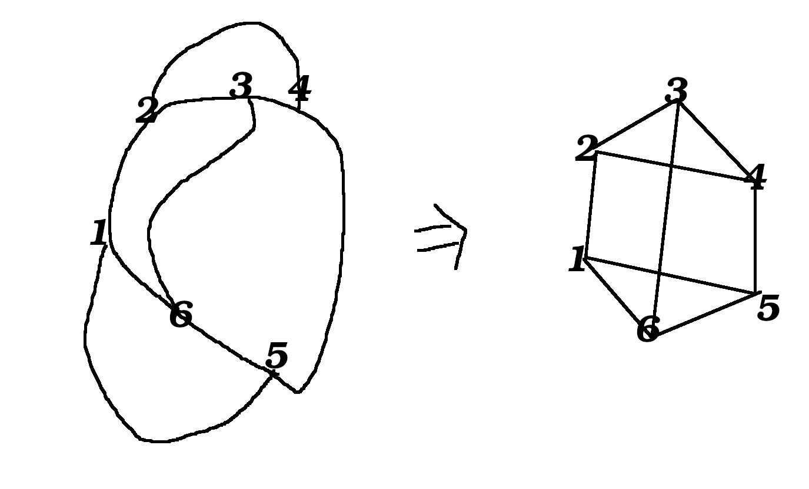
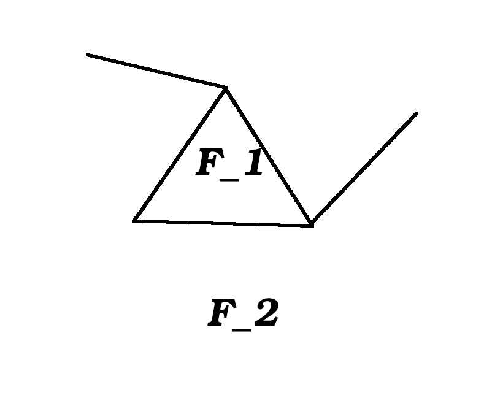

# Lecture 6

## Vertex cover

General?

VC=2  (vertex cover)
MM=1 (minimal matching)

Theorem: min VC <= 2 * MM in general graph.

Matching n Disjoint edges

Min vertex cover >= Max matching

One vertex from each edge

Konig    VC=MM for bipartite graphs

### Proof

Take maximal matching.

Take both endpoints of these edges

It isa VC (vertex cover).
size = 2 * MM

## Complexity

Maximal matching is in P

Min vertex cover is NP-hard

NP hard to approximate within \sqrt(2) * \epsilon

Best gives 2 - O(1)

## Erdos Posa

Theorem: Erdos Posa (chapter 2.3)

How to think of k:
k = sqrt(n) roughly.

Either a graph has k disjoin cycles or there are 4k(logk +loglogk + 5) vertices S such that S \intersect C != 0 for any cycle.

### Proof

**Cycle cover**: a set of verticies that cover all cycles.

G does not have k disjoint cycles. Find a cycle cover of size s_k.

H: maximal subgraph of G where all vertices have degree 2 or 3.

A tree doesn't have this.

A cycle is such a subgraph.

Start with a cycle. Take a path across (ear-composition?) to extend some degree two verticies to degree 3 vertices.

Our S will be (almost) the vertices of degree 3 in H.

(will prove that these are not too many)

Take any cycle C in G.

Does it intersect H?

If intersects a degree 3 in H: done (the cycle is covered).

Otherwise, this cycle can only intersect degree two verticies of H.

If C intersects two different verticies of H we could add a piece to H.

However, that could go against the maximality of H; contradiction.

But two cycles C intersect in exactly 1 point. We can't add it, since that would be degree 4. However, if two cycles intersect at 1 point, and with each other, then we can add a piece.

## Lemma A 3-regular graph

Lemma A 3-regular graph with 4k(logk +loglogk + 4) = n
verticies has >= k disjoint cycles

This lemma completes proof. (?)

Contracted graph has many verticies.

By lemma: H has many degree 3 => H' big => H' has many disjoint cycles => H has many disjoint cycles

## Plane graph

R^2 -> abstract graph G(E, V)
such a graph is planars

Faces: sets in R^2
region bounded by edges.

There is also an outer face.

|V| = 5
|E| = 5
|F| = 2

Planar => No crossing of edges.

### Eulers formula

(important formula in graph theory)

For *non-empty* and *connected* graph.

V: verticies
E: edges
F: faces

|V| - |E| + |F| = 2

Number of faces is independent of how you draw it in the plane.

Proof:

Three cases.

1. Just a point (a single vertex).
2. Has leaf nodes.
3. Has cycles.

case 1: |V| - |E| + F| = 1 - 0 + 1 = 2

Done.

case 2: Removing a leaf node => removing a vertex and removing an edge.

Removing a vertex and removing an edge, then quantity of Euler's formula is preserved.

That means that after this operation, every vertex has degree at least two.

If no leaves, we have a cycle.

case 3: If we have a cycle, there is a face on one side of the cycle and another face on the other side.

An edge in the cycle is adjacent to two different faces.

If we remove the edge, since it was part of a cycle, then the remaining graph is still connected, thus lets us use induction.

By removing an edge from the cycle, one edge is removed, no verticies are removed,
and, two faces are merged into one, thus the quantity of Euler's formula is preserved.

## Planar => |E| <= 3|V| - 6

If G is planar then |E| <= 3|V| - 6

Proof:

Every face is surrounded by at least 3 faces.

A face is either a triangle, a square, etc.

If I sum on every edge, then all edges are counted twice.

Claim: 2|E| >= 3|F|

|F| = |E| - |V| + 2    (from Euler's formula)

(2/3)|E| >= (|E| - |V| + 2)
2|E| >= 3|E| - 3|V| + 6
-|E| >= -3|V| + 6
|E| <= 3|V| - 6

## K^5 is not planar

K^5 is not planar

|E| = (5 choose 2) = 10
|V| = 5

By Euler's formula, not planar.

## K^{3,3} is not planar

K^{3,3}

A bipartite graph does not have any odd cycles.
