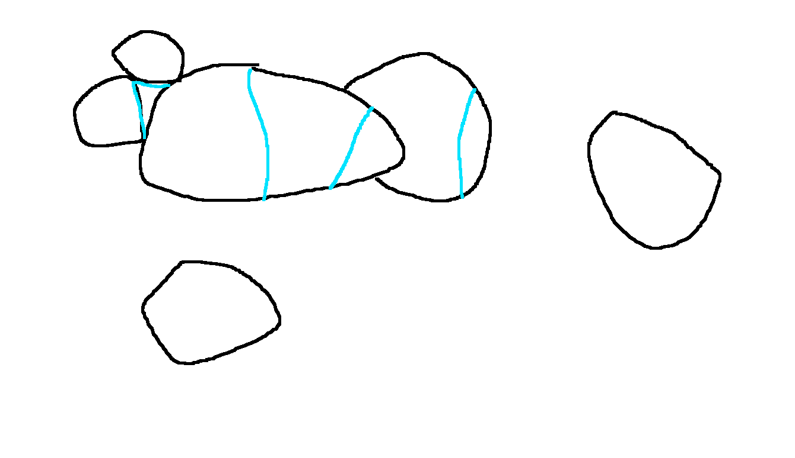

# Lecture 6

## Vertex cover

General?

VC=2  (vertex cover)
MM=1 (minimal matching)

Theorem: min VC <= 2 * MM in general graph.

Matching n Disjoint edges

Min vertex cover >= Max matching

One vertex from each edge

Konig    VC=MM for bipartite graphs

### Proof

Take maximal matching.

Take both endpoints of these edges

It isa VC (vertex cover).
size = 2 * MM

## Complexity

Maximal matching is in P

Min vertex cover is NP-hard

NP hard to approximate within \sqrt(2) * \epsilon

Best gives 2 - O(1)

## Erdos Posa

Theorem: Erdos Posa (chapter 2.3)

How to think of k:
k = sqrt(n) roughly.

Either a graph has k disjoin cycles or there are 4k(log + .... + k + 5) vertices S such that S \intersect C != 0 for any cycle.

### Proof

**Cycle cover**: a set of verticies that cover all cycles.

G does not have k disjoint cycles. Find a cycle cover of size s_k.

H: maximal subgraph of G where all vertices have degree 2 or 3.

A tree doesn't have this.

A cycle is such a subgraph.

Start with a cycle. Take a path across (ear-composition?) to extend some degree two verticies to degree 3 vertices.

Our S will be (almost) the vertices of degree 3 in H.

(will prove that these are not too many)

Take any cycle C in G.

Does it intersect H?

If intersects a degree 3 in H: done (the cycle is covered).

Otherwise, this cycle can only intersect degree two verticies of H.

If C intersects two different verticies of H we could add a piece to H.

However, that could go against the maximality of H; contradiction.

But two cycles C intersect in exactly 1 point. We can't add it, since that would be degree 4. However, if two cycles intersect at 1 point, and with each other, then we can add a piece.

